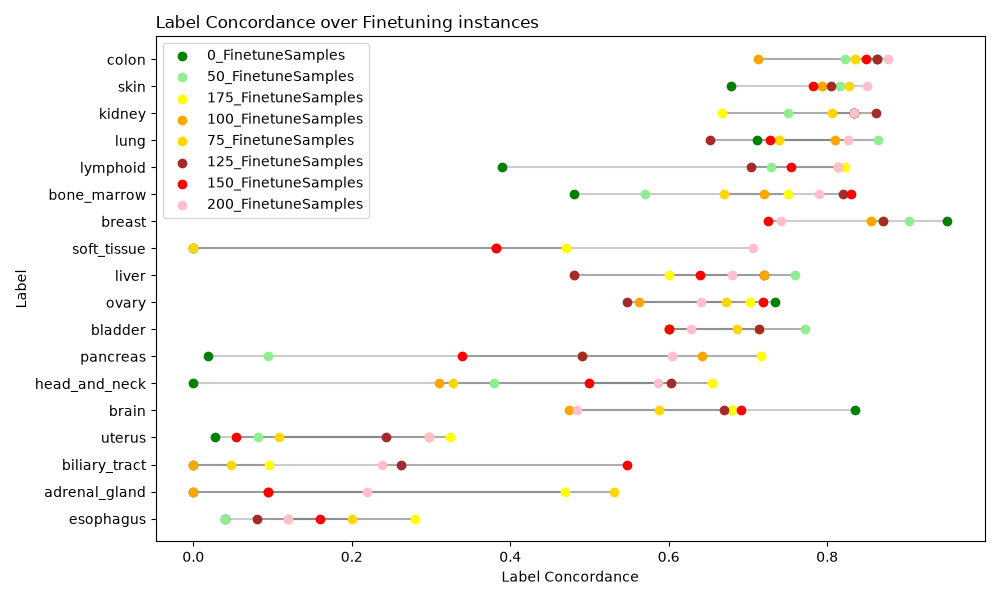

# Inference and Finetuning on Celline gex Data over a model based on Tissue Samples
Core Idea:
if we take a model trained on gex expression data from Tissue Samples of the Atlas Tissue Dataset predict uberron Tissue Type, can we use the same Model to predict "Tissue Types of Celline data" to what extend does Finetuning improves performance  and if so to what extend does the Model compare to Models Trained from scratch.  


# Datasets
- Original Trainig based on https://github.com/BIMSBbioinfo/atlas_tissue_representation.git
  - [processed_scaled_411k_tissue_B_h5.tar.gz](https://zenodo.org/records/20661013/files/processed_scaled_411k_tissue_B_h5.tar.gz)
- Dataset used for Finetuning is can be found under this [link](https://plus.figshare.com/articles/dataset/DepMap_24Q2_Public/25880521)
  - the genen expression data [OmicsExpressionProteinCodingGenesTPMLogp1.csv](https://plus.figshare.com/articles/dataset/DepMap_24Q2_Public/25880521/1?file=46490878)
    - Before Finetuning the Dataset was prepared using the Script in `../Scripts/gex-preparation.py`  
  - for clin a A Priori modified version of the [Model.csv](https://plus.figshare.com/articles/dataset/DepMap_24Q2_Public/25880521/1?file=46489732) which was further modified with the `prepare_clin.csv` Scritp.

# Methods
A supervised_vae Model was trained with the Flexynesis Toolkit to predict uberon Tissue Classification based on the Gene Expression data provided. (`fullgex.sh`)

Run the prepare / cean scripts:
1. gex-preparation.py
2. prepare_clin.csv

Next, finetuning on the celline Data. 
- Create a mapping from OncotreePrimaryDisease to the Labels present in Model or None. (`Scripts/targetva-mapper.py`) 
- Filter for Tissues that have at least 25 Features. (`/Scripts/top_x_featureselection.py`)
- Creating the From scratch datasets based on the samples used for Fineuning via the (`datasplit_same_as_finetune.py`) Script.
- Running the from_scratch.sh script to train the comparison Models
- to create the optimal train environmetnt split the dataset vie the `Scripts/splitdataset-for-low-datavolumetest.py` Script.
- The plots are created via the Script `Scripts/creating_the_plots.py`

# Observation
Performance of Model on its original Tissue Sample Dataset. 
```
supervised_vae,uberon_tissue,categorical,balanced_acc,0.9319992766432235
supervised_vae,uberon_tissue,categorical,f1_score,0.9507821995626191
supervised_vae,uberon_tissue,categorical,kappa,0.9435743085846471
```


Confusion Matrices for each finetune step can be found unter in `Plots/geq_25_confusion_table/`
Note the newly trained model recieved the same Samples to train upon as the Tissue Trained Model for Finetuning.


While learning from scratch with the most fair spread ( 6 per mapped tissue Type totaling 108) the from scracth the from scratch models acheeved the following performance. 
```
balanced_acc,0.57163300301157
f1_score,0.5760778636835013
kappa,0.5401853319267591
```

 

 

Based upon the confusion Metrics, this plot shows the change of \[Label, Label\] over the process of Finetuning We see a significant increae of predictive performance for each Label with fluctuations. of ote are the 

# Interpretation
- to uberon tissue, the Model shows an expected Performance increase throughout finetuning. 
- There is a Notable difference between the Gene express in cellines vs Tissue samples
- despite that the Model perfomes coparatively well and outperforms from scratch Models in the space of < 200 samples.
-  Some tissue types seem to respond better to finetuning than others.
- Of note: Finetuning requires less compute to gain comparable results in low sample environments. Useful for Preliminary exploration and Users with limited accesss to compute poewer (i.e. Students, Smaller Instutuitions, Private personell)
# TODOS
- [ ] Label Concordance simplify to ~100 wehere the plateus
- [ ] Datapaths with explaination
- [ ] Addendumns from E-Mail
- [ ] 