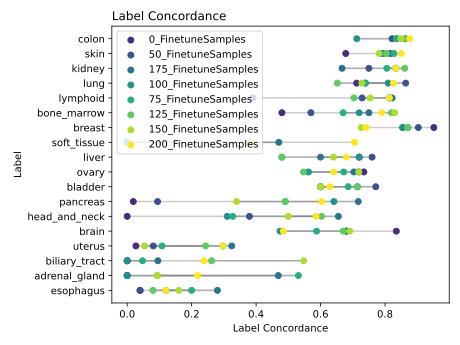

# Inference and Finetuning on Celline gex Data over a model based on Tissue Samples
Core Idea:
if we take a model trained on gex expression data from Tissue Samples of the Atlas Tissue Dataset predict uberron Tissue Type, can we use the same Model to predict "Tissue Types of Celline data" to what extend does Finetuning improves performance  and if so to what extend does the Model compare to Models Trained from scratch.  


# Datasets
- Original Trainig based on https://github.com/BIMSBbioinfo/atlas_tissue_representation.git
  - [processed_scaled_411k_tissue_B_h5.tar.gz](https://zenodo.org/records/20661013/files/processed_scaled_411k_tissue_B_h5.tar.gz)
- Dataset used for Finetuning is can be found under this [link](https://plus.figshare.com/articles/dataset/DepMap_24Q2_Public/25880521)
  - the genen expression data [OmicsExpressionProteinCodingGenesTPMLogp1.csv](https://plus.figshare.com/articles/dataset/DepMap_24Q2_Public/25880521/1?file=46490878)
    - Before Finetuning the Dataset was prepared using the Script in `../Scripts/gex-preparation.py`  
  - for clin a A Priori modified version of the [Model.csv](https://plus.figshare.com/articles/dataset/DepMap_24Q2_Public/25880521/1?file=46489732) which was further modified with the `prepare_clin.csv` Scritp.

# Methods
A supervised_vae Model was trained with the Flexynesis Toolkit to predict uberon Tissue Classification based on the Gene Expression data provided. (`fullgex.sh`)

Run the prepare / cean scripts:
1. gex-preparation.py
2. prepare_clin.csv

Next, finetuning on the celline Data. 
- Create a mapping from OncotreePrimaryDisease to the Labels present in Model or None. (`Scripts/targetva-mapper.py`) 
- Filter for Tissues that have at least 25 Features. (`/Scripts/top_x_featureselection.py`)
- Creating the From scratch datasets based on the samples used for Fineuning via the (`datasplit_same_as_finetune.py`) Script.
- Running the from_scratch.sh script to train the comparison Models
- to create the optimal train environmetnt split the dataset vie the `Scripts/splitdataset-for-low-datavolumetest.py` Script.
- The plots are created via the Script `Scripts/creating_the_plots.py`

Creating the Resample Runs:
- the script `Scripts/sub_and_resample.py` is used to create the Lists of Samples Used for the Resample Runs. 
- Each Resample Run is created by randomly selecting a subset of the samples from the original dataset. But Within the same Resample Run, the heldout Samples are kept for the next order Higher Sample Run.
  - 50 ⊂ 75 ⊂ 100 ⊂ 125 ⊂ 150 ⊂ 175 ⊂ 200.
  - Each Run starts with a different Random Seed so the core Samples for each Run are chosen Randomly.
- The `fullgex_size_filterfull_sweep_resamplesweep.sh` Script is used to run the Resample Finetune Runs.
- The `Scripts/datasplit_same_as_finetune.py` Script is used to create the same Data Split as the Finetune Runs for the from scratch Training.
- The `RESAMPLERUNLIST.sh` Script is used to Train the Models from scratch.
- the `Table_Resample.py` Script is used to create the Table of Resample Model,Samples,Run,balanced_acc,f1_score,kappa,average_auroc,average_aupr for each model.
- the `Scripts/creating_the_plots.py` once again is used to create the Plots.

 The from_scratch models recieve exactly the same data for Training and Testing as the pretrained Model for Finetuning and the evaluation mehtodes are the same.
# Observation
Performance of Model on its original Tissue Sample Dataset. 
```
supervised_vae,uberon_tissue,categorical,balanced_acc,0.9319992766432235
supervised_vae,uberon_tissue,categorical,f1_score,0.9507821995626191
supervised_vae,uberon_tissue,categorical,kappa,0.9435743085846471
```

The Plots are created via the `Scripts/creating_the_plots.py` Script.
The Number in #_Finetunesamples indicates the total amount of Finetune samples.
The barplot datasets have atleast one of each label in the Dataset.


Each Run contains et least 1 sample per label. All Subsets (including the min 1 per label) are chosen by chance. The heldout Sets are subsets of each other (i.e. the heldout Set in 50 Samples of a Run is a subset of the 100 Samples Set in the same Run) in each Run the Runs are independently chosen at random.
Of note the Horizontal Lines show when the mean score from scratch Training overtakes the mean score of Finetuning for the first Time.


Confusion Matrices for each finetune step can be found unter in `Plots/geq_25_confusion_table/`
Note the newly trained model recieved the same Samples to train upon as the Tissue Trained Model for Finetuning.


While learning from scratch with the most fair spread ( 6 per mapped tissue Type totaling 108) the from scracth the from scratch models acheeved the following performance. 
```
balanced_acc,0.57163300301157
f1_score,0.5760778636835013
kappa,0.5401853319267591
```

 

 

Based upon the confusion Metrics, this plot shows the change of \[Label, Label\] over the process of Finetuning We see a significant increae of predictive performance for each Label with fluctuations. of ote are the 

# Interpretation
- to uberon tissue, the Model shows an expected Performance increase throughout finetuning. 
- There is a Notable difference between the Gene express in cellines vs Tissue samples
- despite that the Model perfomes coparatively well and outperforms from scratch Models in the space of < 200 samples.
-  Some tissue types seem to respond better to finetuning than others.
- Of note: Finetuning requires less compute to gain comparable results in low sample environments. Useful for Preliminary exploration and Users with limited accesss to compute poewer (i.e. Students, Smaller Instutuitions, Private personell)
- **Pretraining on the large tissue-expression dataset reduces the amount of labelled target-domain data required to achieve useful performance. Its advantage is strongest when cell-line training data are scarce, whereas sufficient target-domain data eventually allow de-novo training to reach or exceed the fine-tuned model.**

# TODOS
- [ ] Label Concordance simplify to ~100 wehere the plateus
- [x] Datapaths with explaination
- [x] Addendumns from E-Mail


# Dateipfad Grob explained
```
atlas_tissue_representation/
├── Data/ <- Contains all  the Data Produced
│   ├── 0_FinetuneSamples_split/ <- Start of Signular From Scrath Data Like Finetune
│   . . . .
│   ├── 75_FinetuneSamples_split/     <- END of Signular From Scrath Data Like Finetune
│   ├── Resampleruns/...            <- Contains the clin and Gex train test splits for the Resampled Data Runs
│   ├── celline-data/ <- Celline data
│   │   ├── README.md 
│   │   ├── clin-old.csv <- Old_clin version 
│   │   ├── clin.csv <- Current clin version
│   │   ├── gex-final.csv <- Final Processed gex version
│   │   ├── gex.csv <- same versiion renamed  
│   │   ├── old-gex.csv <- Old gex version
│   │   ├── possible_attributes_for_mapping.txt
│   ├── low-data-split/ <- Low data split for barplot
│   ├── more_than_25_samples/ <-        IMPoRTANT contains the Data  for the more than 25 Samples List
│   ├── onco-cellinedata/
│   └── processed_scaled_411k_tissue_B_h5/ <- THE ORIGINAL DATASET
├── Models/ <- CONTAINS THE TISSUE MODEL and THE FROM SCRATCH MODELS
│   ├── Atlas-uberon_tissue-SupervisedVAE/ <- THE ORIGINAL TISSUE MODEL
│   ├── Resample/ <- THE RESAMPLED TISSUE MODEL
│   ├── like_finetune_split/ <- THE FINETUNED MODELS SINGULAR SPLIT
├── Plots/                    <- Contains Figures and tables
│   ├── Performance of Finetuned Models geq 25balanced_acc_box.svg <- Boxplot of balanced accuracy for finetuned models
│   ├── Performance of Finetuned Models geq 25f1_score_box.svg <- Boxplot of f1 score for finetuned models
│   ├── Performance of Finetuned Models geq 25kappa_box.svg <- Boxplot of kappa for finetuned models
│   ├── Performance of Models geq 25balanced_acc.svg <- Boxplot of balanced accuracy for SINGLE RUN models
│   ├── Performance of Models geq 25f1_score.svg <- Boxplot of f1 score for SINGLE RUN models
│   ├── Performance of Models geq 25kappa.svg <- Boxplot of kappa for SINGLE RUN models
│   ├── Resample_finetuned_stats.csv <- Statistics for finetuned models resampled from the resampled tissue model
│   ├── Resample_from_scratch_stats.csv <- Statistics for finetuned models resampled from scratch
│   ├── geq_25_confusion_table/ <- Confusion matrices for finetuned models Singular Run
│   ├── lollipopplot_25_and_more_samples_Finetuning.svg <- Lollipop plot of f1 score for finetuned models
│   ├── low_sample_table/ <- Confusion matrices for finetuned models trained on low sample sizes
│   └── top_9_tissues.svg
├── README.md
├── RESAMPLERUNLIST.sh <- 
├── Scripts/
│   ├── Table_Resample.py <- Table Resample script
│   ├── creating_the_plots.py
│   ├── dataset_stats.py
│   ├── gex-preparation.py
│   ├── prepare_clin.py
│   ├── splitdataset-for-low-datavolumetest.py
│   ├── sub_and_resample.py
│   ├── targetva-mapper.py
│   └── top_x_featureselection.py
├── atlas-second-command.sh
├── filetree.txt
├── finetune_filepathtest.sh
├── from_scratch.sh
├── fullgex-finetune.sh
├── fullgex-leq-than-60.sh
├── fullgex-top10-features.sh
├── fullgex.sh
├── fullgex_size_filterfull_sweep.sh
├── fullgex_size_filterfull_sweep_resamplesweep.sh
├── fullgex_size_filterfull_sweep_resamplesweep_inf.sh
├── low-train-sample.sh
├── makebuckets.sh
├── oncotop9-finetune/
├── size_filterd/
│   ├── Resampled/
│   ├── geq_25_samples/
│   │   └── resample/
│   └── slurm-reports/
└── template-res/

```